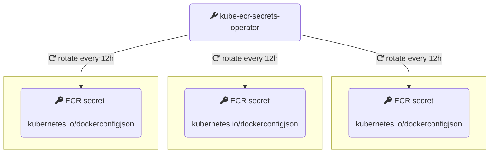

[](https://artifacthub.io/packages/search?repo=kube-ecr-secrets-operator)

## kube-ecr-secrets-operator:

Kubernetes operator that helps dealing with `ImagePullBackOff` errors that may arise if a pod is rescheduled or re-started. A pod can be rescheduled or re-started any time of the day, under specific conditions (eviction, application crash,..etc). Because [AWS ECR](https://aws.amazon.com/ecr/) credentials expire every 12 hours, this may lead to disruptions due to the inability to pull the pod image, especially if the image pull policy is set to `Always`. 




kube-ecr-secrets-operator manages AWS ECR (Elastic Container Registry) secrets cluster wide. ECR docker credentials expire every 12 hours, and need to be refreshed periodically to avoid any workload disruption that may arise from a direct human action like a deploy or Kubernetes initiated action like a pod reschedule. It introduces the `ClusterAWSECRImagePullSecret` (cluster scoped) and the `AWSECRImagePullSecret` (namespaced) CRDs that:

1. creates a docker credential kubernetes secret
2. Once the secrets are created, the controller takes care of refreshing them periodically (every 12h)

## Examples:

```
apiVersion: aws.zakariaamine.com/v1alpha2
kind: AWSECRImagePullSecret
metadata:
  name: my-ecr-credentials
spec:
  awsAccess:
    accessKeyId: YOUR_ACCESS_KEY_ID
    secretAccessKey: YOUR_SECRET_ACCESS_KEY
    region: THE_ECR_REGION
  secretName: ecr-login
```

If the secret needs to be managed in several namespaces, the `ClusterAWSECRImagePullSecret` cluster scoped CRD can be used. It has an additional `namespaces` field under `spec` that allows specifying the namespaces.

```
apiVersion: aws.zakariaamine.com/v1alpha2
kind: ClusterAWSECRImagePullSecret
metadata:
  name: test-ecr-credentials
spec:
  awsAccess:
    accessKeyId: YOUR_ACCESS_KEY_ID
    secretAccessKey: YOUR_SECRET_ACCESS_KEY
    region: THE_ECR_REGION
  secretName: ecr-login
  namespaces:
    - ns1
    - ns2
    - ns3
```

## Installation and Usage:

The operator can be installed using helm:

```
helm repo add zakariaamine https://zak905.github.io/kube-ecr-secrets-operator/repo-helm

helm repo update 

helm install --create-namespace kube-ecr-secrets-operator zakariaamine/kube-ecr-secrets-operator -n kube-ecr-secrets-operator-system

```

Once the chart is installed, `AWSECRImagePullSecret` and `ClusterAWSECRImagePullSecret` objects can be created.

It is, off course, highly recommended to limit the permissions of the IAM user to ECR only. Needless to say, the usage of the root AWS user credentials is highly discouraged.

## CRDs:

The CRDs definitions are part of the helm chart. A known shortcoming of using helm to install CRDs is the inability to update the CRDs (if there is a change) on subsequent chart upgrades. To overcome the shortcoming, one of the following solutions can help:
* The chart can be uninstalled and installed when there is a new release with a CRD change.
* The CRDs can be installed using `kubectl` as a first step:
  
``` 
kubectl apply -f https://raw.githubusercontent.com/zak905/kube-ecr-secrets-operator/refs/heads/master/chart/crds/aws.zakariaamine.com_awsecrcredentials.yaml
kubectl apply -f https://raw.githubusercontent.com/zak905/kube-ecr-secrets-operator/refs/heads/master/chart/crds/aws.zakariaamine.com_awsecrimagepullsecrets.yaml
kubectl apply -f https://raw.githubusercontent.com/zak905/kube-ecr-secrets-operator/refs/heads/master/chart/crds/aws.zakariaamine.com_clusterawsecrimagepullsecrets.yaml
```

and then the chart can be installed with the `--skip-crds` flag.

## Monitoring and Troubleshooting:

The CRs status stanza reports the current state of the CR objects. In case an unexpected behavior is observed, the first step for troubleshooting is to inspect the `status`: `kubectl get awsecrimagepullsecret the-name-of-the-object`. For example:

```
  status:
    conditions:
    - lastTransitionTime: "2023-10-04T20:45:52Z"
      message: 'AWS ECR secret with type kubernetes.io/dockerconfigjson have been
        created/updated successfully in namespaces: [ns1] next update at: 2023-10-05
        08:45:52.269 +0000 UTC'
      reason: SecretsUpdated
      status: "True"
      type: Ready

```

The `status`  provides enough information to identify potential issues. Additionally, the controller emits Kubernetes events whenever an action is taken. The following events can be observed: `SecretCreationSuccess`, `SecretUpdateSuccess`, `CreateSecretError`, `UpdateSecretError`.

The logs of the controller pod can also help: `kubectl logs -l app.kubernetes.io/name=kube-ecr-secrets-operator -n kube-ecr-secrets-operator-system `

## Running Tests:

To run tests, the following environment variables need to set `AWS_ACCESS_KEY_ID`, `AWS_SECRET_ACCESS_KEY`, `AWS_REGION` in the terminal from which the tests are run. Afterwards, the tests can be run using: `make unit-test`

## Kubernetes version compatibility:

The controller is tested against the latest three (minor) Kubernetes versions.