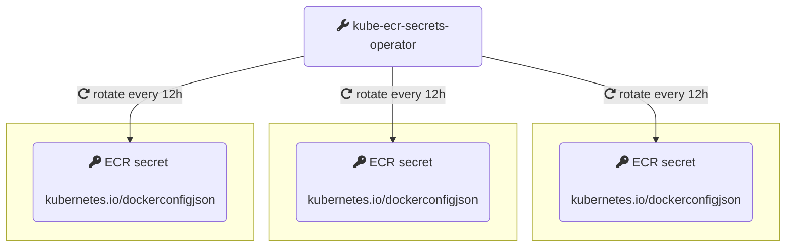

[](https://artifacthub.io/packages/search?repo=kube-ecr-secrets-operator)

## kube-ecr-secrets-operator:




Kubernetes Operator for managing AWS ECR (Elastic Container Registry) secrets cluster wide. ECR docker credentials expire every 12 hours, and need to be refreshed whenever you need to deploy. This operator's goal is to help manage the ECR image pull secrets by refreshing them periodically. It introduces the `AWSECRCredentials` cluster scoped object that:

1. creates a docker credential secret in all the specified namespaces upon creation
2. Once the secrets are created, the operator takes care of refreshing them periodically (every 12h)

Here is an example of the `AWSECRCredentials` specification:

```
apiVersion: aws.zakariaamine.com/v1alpha1
kind: AWSECRCredential
metadata:
  name: my-ecr-credentials
spec:
  awsAccess:
    accessKeyId: YOUR_ACCESS_KEY_ID
    secretAccessKey: YOUR_SECRET_ACCESS_KEY
    region: THE_ECR_REGION
  secretName: ecr-login
  namespaces:
    - ns1
    - ns2
    - ns3
    - ns4
```

## Installation and Usage:

The operator expects [cert-manager](https://github.com/cert-manager/cert-manager) to be present in the cluster, since it makes use of `Issuer` and `Certificate` kinds. Because there are some gotchas related to having cert-manager as a subchart(See this [issue](https://github.com/cert-manager/cert-manager/issues/3246) and this [issue](https://github.com/cert-manager/cert-manager/issues/3116) for more details ), kube-ecr-secrets-operator leaves the responsibility to the chart consumer to install it. Installation instructions can be found in the official [docs](https://cert-manager.io/docs/installation/helm/)

The operator can be installed using helm:

```
#adding the repo
helm repo add zakariaamine https://zak905.github.io/kube-ecr-secrets-operator/helm-repo

helm repo update 

helm install --create-namespace kube-ecr-secrets-operator zakariaamine/kube-ecr-secrets-operator -n kube-ecr-secrets-operator-system

```

Once the chart is installed, `AWSECRCredentials` objects can be created.

It is, off course, highly recommended to limit the permissions of the IAM user represented by the credentials to ECR only.

## CRDs:

The `AWSECRCredentials` CRD definition is installed with the helm chart using the crds folder. However, a known shortcoming of using helm to install CRDs is the inability to update the CRDs (if there is a change) on subsequent chart upgrades. To overcome the shortcoming, one of the following solutions can help:
* The chart can be uninstalled and installed when there is a new release with a CRD change.
* The CRDs can be installed using `kubectl` as a first step `kubectl apply -f https://raw.githubusercontent.com/zak905/kube-ecr-secrets-operator/master/chart/crds/AWSECRCredentials.yaml`, and then the chart can be installed with the `--skip-crds` flag.

## Troubleshooting:

In case an unexpected behavior is observed, the first step for troubleshooting is to inspect the `status` of `AWSECRCredentials` object: `kubectl get awsecrcredentials the-name-of-the-object`. The `status` shows informations about the current state of the object. For example:

```
  status:
    conditions:
    - lastTransitionTime: "2023-10-04T20:45:52Z"
      message: 'AWS ECR secret with type kubernetes.io/dockerconfigjson have been
        created/updated successfully in namespaces: [ns1] next update at: 2023-10-05
        08:45:52.269 +0000 UTC'
      reason: SecretsUpdated
      status: "True"
      type: Ready

```

The `status`  provides enough information to identify potential issues. Additionally, the contoller emits Kubernetes events whenever an action is taken. The following event can be observed: `SecretCreationSuccess`, `SecretUpdateSuccess`, `CreateSecretError`, `UpdateSecretError`.


The logs of the contoller pod can also help: `kubectl logs -l app.kubernetes.io/name=kube-ecr-secrets-operator -n kube-ecr-secrets-operator-system `

## Shortcomings:

* Depends on [cert-manager](https://github.com/cert-manager/cert-manager) (for now)
* An `AWSECRCredentials` object can manage only a single AWS region, which means that if you have multiple registries in different regions, you need to create an `AWSECRCredentials` for each.

## Running Tests:

To run tests, the following environment variables need to set `AWS_ACCESS_KEY_ID`, `AWS_SECRET_ACCESS_KEY`, `AWS_REGION` in the terminal from which the tests are run. Afterwards, the tests can be run using: `make test`
  
## Future improvements ideas

* attempt to remove the dependency on `cert-manager`. Since TLS is only for internal usage, and a self signed certificate is enough, a certificate can be manually created by the operator or by a job when the chart is installed. The certificate can have an expiry date very far ahead in the future so that it does not need to be renewed. 
* making `AWSECRCredentials` manage registries for several AWS regions