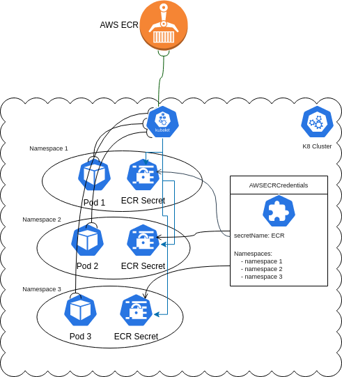

[](https://artifacthub.io/packages/search?repo=kube-ecr-secrets-operator)

## kube-ecr-secrets-operator:



Kubernetes Operator for managing AWS ECR (Elastic Container Registry) secrets cluster wide. ECR docker credentials expire every 12 hours, and need to be refreshed whenever you need to deploy. I have seen this pre-build script pattern repeat in many CI/CD scripts for projects using ECR:
```
kubectl delete --ignore-not-found=true secret ecr -n $NAMESPACE && \
kubectl create secret docker-registry ecr \
--docker-server=$AWS_ACCOUNT_ID.dkr.ecr.$AWS_REGION.amazonaws.com \
--docker-username=AWS \
--docker-password=$(aws ecr get-authorization-token --region $AWS | jq --raw-output '.authorizationData[0].authorizationToken' | base64 -d | cut -d: -f2) \
-n $NAMESPACE

```
This can get quickly messy, if you have different secrets for different AWS registries across different namespaces. This operator's goal is to help manage those secrets and avoid running those commands whenever a deploy/update is needed. It introduces the `AWSECRCredentials` cluster scoped object that:

1. creates a docker credential secret in all the specified namespaces upon creation
2. Once the secrets are created, the operator takes care of refreshing them when a pod is created/updated (if the pod is refering to the secret in concern)

Here is an example of the `AWSECRCredentials` specification:

```
apiVersion: aws.zakariaamine.com/v1alpha1
kind: AWSECRCredential
metadata:
  name: my-ecr-credentials
spec:
  awsAccess:
    #secret containing AWS access used to get the ECR secret from AWS
    secretName: aws-access
    #optional namespace of the aws-access secret. Defaults to default.
    namespace: default
  #the name of the K8 secret that will be created
  secretName: ecr-login
  #all the namespaces in which the operator will create and manage ecr secrets
  namespaces:
    - ns1
    - ns2
    - ns3
    - ns4
```

## How does it work:

The idea of this operator is to avoid doing busy polling (e.g refreshing secrets on a fixed time interval) and thus wasting CPU cycles. It listens on pod creation/update, and checks if the docker credentials has expired, if it's the case, it asks AWS for a new ECR login token and updates the secrets. Otherwise, it does nothing and lets Kubernetes use the current secret. This is achieved using [Admission Webhooks](https://kubernetes.io/docs/reference/access-authn-authz/extensible-admission-controllers/). 

## Installation and Usage:

The operator expects [cert-manager](https://github.com/cert-manager/cert-manager) to be present in the cluster, since it makes use of `Issuer` and `Certificate` kinds. Because there are some gotchas related to having cert-manager as a subchart(See this [issue](https://github.com/cert-manager/cert-manager/issues/3246) and this [issue](https://github.com/cert-manager/cert-manager/issues/3116) for more details ), kube-ecr-secrets-operator leaves the responsibility to the chart consumer to install it. Installation instructions can be found in the official [docs](https://cert-manager.io/docs/installation/helm/)

The operator can be installed using helm:

```
helm repo add zakariaamine https://zak905.github.io/kube-ecr-secrets-operator/chart

helm repo update 

helm install kube-ecr-secrets-operator zakariaamine/kube-ecr-secrets-operator

```

Once the chart is installed, `AWSECRCredentials` objects can be created.

Before any `AWSECRCredentials` can be created, the secret refered to by `awsAccess` property needs to be present with following keys: `AWS_ACCESS_KEY_ID`, `AWS_SECRET_ACCESS_KEY`, and `AWS_REGION`. For example:

```
apiVersion: v1
data:
  AWS_ACCESS_KEY_ID: ACCESSKEYID
  AWS_SECRET_ACCESS_KEY: secretaccesskey
  AWS_REGION: us-east-1
kind: Secret
metadata:
  name: aws-access
```

It is, off course, highly recommended to limit the permissions of the IAM user represented by the credentials to ECR only.

## Pros and Cons:

Pros:
* You get your hands completely off the ECR credentials inside the K8 cluster
* Relies on admissions webhooks instead of periodically renewing ECR credentials
  
Cons:

* Depends on [cert-manager](https://github.com/cert-manager/cert-manager) (for now)
* A `AWSECRCredentials` object can manage only a single AWS region, which means that if you have multiple registries in different regions, you need to create an `AWSECRCredentials` for each.
  
## Future improvements ideas

* attempt to remove the dependency on `cert-manager`. Since TLS is only for internal usage, and a self signed certificate is enough, a certificate can be manually created by the operator or by a job when the chart is installed. The certificate can have an expiry date very far ahead in the future so that it does not need to be renewed. 
* making `AWSECRCredentials` manage registries for several AWS regions
* add static Kubernetes manifests for people who do not want to use helm
* Adding CI/CD, e2e testing